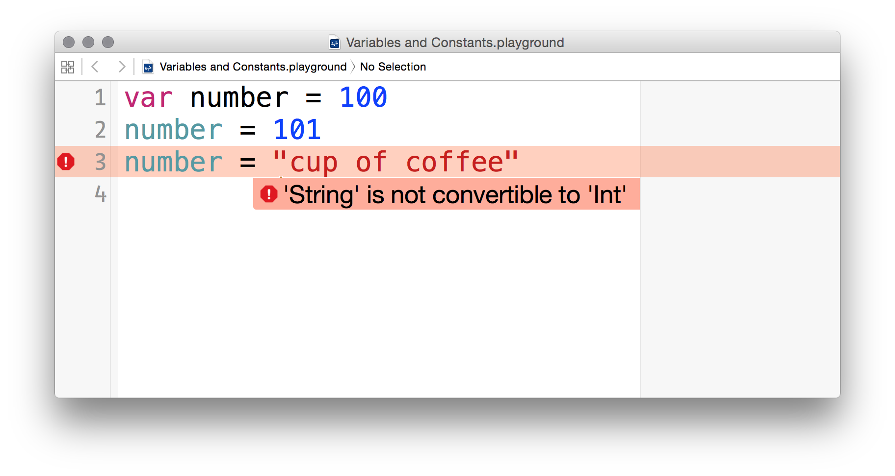

# Variables and Constants

## Variables

If you've played with other programming languages, you're probably already familiar with the idea of variables. In short, variables are a way to give something a name so that you can reference it later in your application. It goes without saying that variables are a core concept in most programming languages.

At first glance, the syntax for declaring variables is very similar to other languages:

```swift
var number = 100
```

We've stored the value `100` in a variable called `number`, which means we could talk about it later and do something along the lines of:

```swift
println(number + 1)
```

`println` is a function in Swift that will log the result of a given expression to the console.

At first glance, the syntax looks a lot like JavaScript and a bit like Ruby or Python. But there are some subtle differences.

The languages mentioned above have what's called dynamic typing, which they don't really care what type of value you set a variable to.

The following is valid in a language like JavaScript, but is not okay in Swift:

```js
var number = 100
number = "one hundred"
number = true
```

Swift uses static typing. This means that once we set a variable, we can only change it to another value of the same type. If we set `number` to 100, we can change it to `101`, but we couldn't change it to a string like "cup of coffee".



Swift isn't the only language that does this. Other languages like Java and C use static typing too. But they usually make you declare your type up front.

In Java, you'd see something like this:

```java
int number = 100;
```

Swift is better than that: it says to itself, "Hey, this programmer handed me a number, so they must want this variable to be an integer." You don't have to worry about it yourself—unless you want to.

But let's say you want to declare a variable, but you don't have a value to hand it yet? Well, then—yea—you're going to need to tell Swift up front what kind of value you plan on storing in this variable.

You could do something along the lines of:

```swift
var number: Int
number = 100

// Alternatively…
var number: Int = 100
```

Swift is pretty liberal about what you're allowed to use a variable name. Most unicode characters are valid. The following code is totally fine in Swift:

```swift
var ⛄️ = "snowman"
var µ = 12
```

## Constants

Variables should be familiar to you if you've used other languages before, but they're actually a lot less common in Swift than in some other languages. More often, Swift makes use of constants, which use the `let` keyword.

Let's build off the example from above:

```swift
let number = 100
```

So far, this looks pretty similar to declaring a variable. The only difference is that we're using `let` instead of `var`. The major difference is that we can't actually change the value of a constant once we've set it.

(IMAGE: Picture of syntax error for constants)

In Swift, using constants is preferred over using variables. Immutable data (data which don't change) are easy to work with and the compiler can even make some performance optimizations with the understanding that the values assigned to constants aren't going to change.

**Rule of Thumb**: When in doubt, use a constant unless you know for a fact that you need a variable.
