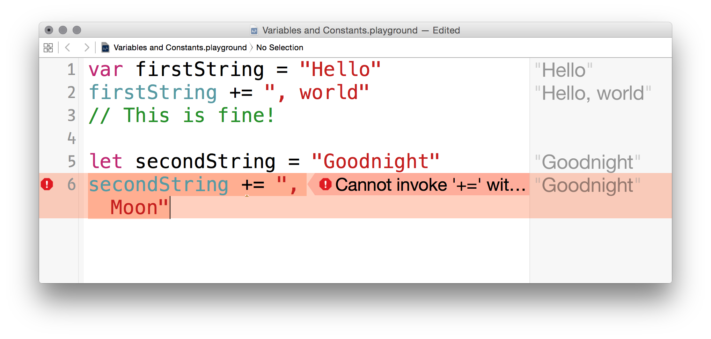
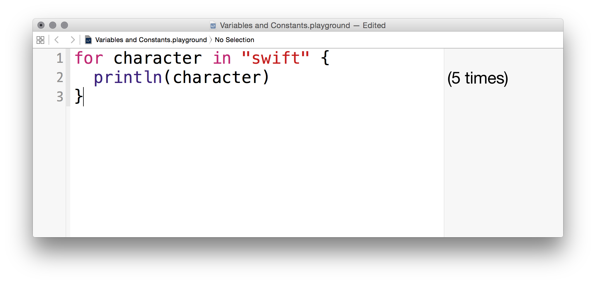

# Strings

Like other languages, Swift has strings.

```swift
let aString = "This is a string!"
```

Ruby and JavaScript allow you to use either single- or double-quoted strings. Swift isn't as liberal. Only double quoted strings are valid in Swift.

## String Iterpolation

Swift supports string interpolation, which means we can embed our Swift values and expressions in our strings. We do this using `\(…)` in our strings.

```swift
let aNumber = 58
println("Your special number is \(aNumber).")
// This would log: "Your special number is 58."

println("Two plus two equals \(2 + 2).")
// This would log: "Two plus two equals four."
```

### Quick Practice

Can you create a constant called `myFavoriteColor` and interpolate that constant into a string announcing that we should paint the town your favorite color?

## String Mutability

In some languages, strings are mutable—which means we can modify their contents. Does Swift has mutable strings? Well, the answer is that it depends on whether you defined your string as a constant or a variable.



## Working with Strings

Swift comes with some built-in functions and methods for working with strings.

We'll cover more of these as they come up, but here a few quick ones for now.

```swift
countElements("four") // returns 4
```

We can also iterate over the contents of a string:

```swift
for character in "swift" {
  println(character)
}
```

The code above will print each console. (We've accidentally touched on iteration, but we'll get more into that later. I promise.) If your playground you might see something along the lines of `(5 times)`, but if we click on the little plus sign in your playground, you can see each iteration.



We also have two ways to check if a string if empty (e.g. `""`).

```swift
let emptyString = ""

emptyString.isEmpty
isEmpty(emptyString)
```

Both of the above will return true.

Swift also has some methods that will change the case of a string—with a catch: Some functionality is built into the language itself and some is actually kept in [Apple's Foundation framework][foundation]. If you want to use `NSString`'s `uppcaseString` method you have to `import Foundation` at the beginning of your file.

[foundation]: https://developer.apple.com/library/mac/documentation/Cocoa/Reference/Foundation/ObjC_classic/index.html

```swift
import Foundation

let greeting = "hello"

greeting.uppercaseString // returns "HELLO"
greeting.uppercaseString.lowercaseString // returns "hello"
```
